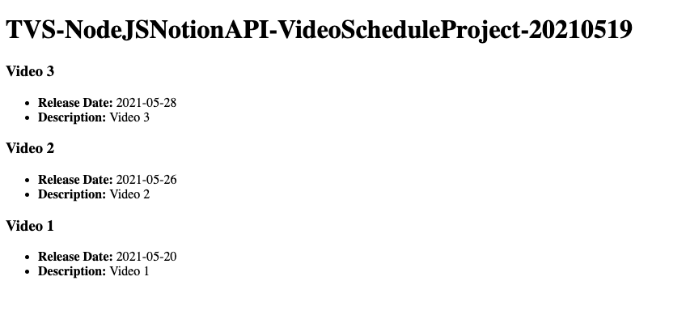

# TVS-NodeJSNotionAPI-VideoScheduleProject-20210519

> 🧩 Travsersy Media - The New Notion API | Node.js Video Schedule Project (May 19, 2021)

Link: https://www.youtube.com/watch?v=9JdP-S3crt8&ab_channel=TraversyMedia

**Description**
> In this video, we will create a Notion calendar database and use the API and SDK/client to fetch the data and display it on a web page

Code: https://github.com/bradtraversy/notion-video-schedule

Notion Developers/API Website: https://developers.notion.com/

Notion JS SDK: https://github.com/makenotion/notion-...

Timestamps:
* 0:00 - Intro
* 1:55 - Add Video Data in Notion
* 4:25 - Explore API & Create Integration
* 7:03 - Using the SDK/Client
* 11:47 - Fetch Video Data & Construct Object
* 21:22 - Create Endpoint with Express
* 23:50 - Creating the Frontend

---


### Table of Contents

- [TVS-NodeJSNotionAPI-VideoScheduleProject-20210519](#tvs-nodejsnotionapi-videoscheduleproject-20210519)
    - [Table of Contents](#table-of-contents)
- [0 - Notion Api Docs](#0---notion-api-docs)
- [155 Add Video Data in Notion](#155-add-video-data-in-notion)
- [425 Explore API & Create Integration](#425-explore-api--create-integration)
  - [Notion API](#notion-api)
  - [Create New Integration](#create-new-integration)
  - [Copy the Secrets Internal Integration Token](#copy-the-secrets-internal-integration-token)
  - [Using ya HTTP Client](#using-ya-http-client)
- [703 Using the SDK / Client](#703-using-the-sdk--client)
  - [Install Notion SDK](#install-notion-sdk)
  - [Add Scripts to Package.json](#add-scripts-to-packagejson)
  - [Index.js](#indexjs)
  - [.env](#env)
  - [Getting Id using code instead of http client](#getting-id-using-code-instead-of-http-client)
- [1147 Fetch Video Data and Construct Object](#1147-fetch-video-data-and-construct-object)
  - [Knowing each result object's properties](#knowing-each-result-objects-properties)
  - [Recreating Data to Custom Objects](#recreating-data-to-custom-objects)
  - [Move Codes to services/notion.js](#move-codes-to-servicesnotionjs)
  - [Import to index.js](#import-to-indexjs)
- [2122 Create Endpoint with ExpressJS](#2122-create-endpoint-with-expressjs)
- [2350 Creating the Frontend](#2350-creating-the-frontend)
  - [Static](#static)
  - [Index.html](#indexhtml)
  - [main.js](#mainjs)

---

# 0 - Notion Api Docs

[Start building with the Notion API](https://developers.notion.com/reference/intro)

# 155 Add Video Data in Notion

1. Add a new Calendar Page
2. Click on a random day on calendar
3. Fields:
    1. Title (default) ex: Video 1
    2. Date start (default) 
    3. Description - text field ex: Video 1

# 425 Explore API & Create Integration

## Notion API

[Start building with the Notion API](https://developers.notion.com/reference/intro)

## Create New Integration

Name: TVS-NodeJSNotionAPI-VideoScheduleProject-20210519

Logo: N/A

Integration Type: Internal

## Copy the Secrets Internal Integration Token

## Using ya HTTP Client

Authorization: Bearer Token, then paste the secret integ token

Now if you try this endpoint: [https://api.notion.com/v1/databases](https://api.notion.com/v1/databases)

its now at status 200 ! however the results in the data received is still empty.

Go back to the calendar page you just a while ago then find share

select the integration we just made with permission: edit

now if you try sending the request again, you shall see the results data

# 703 Using the SDK / Client

```bash
mkdir TVS-NodeJSNotionAPI-VideoScheduleProject-20210519
cd TVS-NodeJSNotionAPI-VideoScheduleProject-20210519
npm init -y

npm i dotenv express nodemon
```

## Install Notion SDK

- Simple and Easy to use client for Notion API

[makenotion/notion-sdk-js](https://github.com/makenotion/notion-sdk-js)

```bash
npm i @notionhq/client
```

## Add Scripts to Package.json

```json
{
  "name": "TVS-NodeJSNotionAPI-VideoScheduleProject-20210519",
  "version": "1.0.0",
  "description": "",
  "main": "index.js",
  "scripts": {
    "test": "echo \"Error: no test specified\" && exit 1",
    "start": "node index",
    "dev": "nodemon index"
  },
  "keywords": [],
  "author": "",
  "license": "ISC",
  "dependencies": {
    "@notionhq/client": "^0.1.3",
    "dotenv": "^9.0.2",
    "express": "^4.17.1"
  },
  "devDependencies": {
    "nodemon": "^2.0.7"
  }
}
```

## Index.js

create new index.js

```jsx
const dotenv = require('dotenv').config()
```

## .env

create new .env file

```jsx
NOTION_TOKEN="" // you get this from the integ secret we saw a while ago 
NOTION_DATABASE_ID="3af51cce-d263-45f5-8ee0-14f34deb983b" // when you tried the listing of databases a while ago, you might have seen the id
```

## Getting Id using code instead of http client

index.js

```jsx
const dotenv = require('dotenv').config();
const { Client } = require('@notionhq/client');

//Init Client
const notion = new Client({
  auth: process.env.NOTION_TOKEN
})

const listDatabases = async () => {
  const res = await notion.databases.list()
  console.log(res);
}

listDatabases()
```

and after saving if you run npm run dev with nodemon, you should see the log on console. you find the id

but yeah you can delete the listDatabases now since that was just for demo hehe

# 1147 Fetch Video Data and Construct Object

Query a Database API

[Start building with the Notion API](https://developers.notion.com/reference/post-database-query)

index.js

```jsx
const dotenv = require('dotenv').config();
const { Client } = require('@notionhq/client');

//Init Client
const notion = new Client({
  auth: process.env.NOTION_TOKEN
})

// START: Getting Id using code instead of http client @e1147
// const listDatabases = async () => {
//   const res = await notion.databases.list()
//   console.log(res);
// }

// listDatabases()
// END: Getting Id using code instead of http client @e1147

const notionDatabaseId = process.env.NOTION_DATABASE_ID;

const getVideos = async () => {
  const payload = {
    path: `databases/${notionDatabaseId}/query`,
    method: "POST"
  }

  const { results } = await notion.request(payload)

  console.log(results)
}

getVideos()
```

## Knowing each result object's properties

```jsx
const getVideos = async () => {
  const payload = {
    path: `databases/${notionDatabaseId}/query`,
    method: "POST"
  }

  const { results } = await notion.request(payload)

  const videos = results.map(result => {
    console.log(result.properties)
  })
}

getVideos()
```

## Recreating Data to Custom Objects

index.js

```jsx
const dotenv = require('dotenv').config();
const { Client } = require('@notionhq/client');

//Init Client
const notion = new Client({
  auth: process.env.NOTION_TOKEN
})

// START: Getting Id using code instead of http client @e1147
// const listDatabases = async () => {
//   const res = await notion.databases.list()
//   console.log(res);
// }

// listDatabases()
// END: Getting Id using code instead of http client @e1147

const notionDatabaseId = process.env.NOTION_DATABASE_ID;

/**
 * @name getVideos()
 * @description get the videos from the given database
 */
const getVideos = async () => {
  const payload = {
    path: `databases/${notionDatabaseId}/query`,
    method: "POST"
  }

  const { results } = await notion.request(payload)

  const videos = results.map(result => {
    // Knowing each result object's properties
    // console.log(result.properties) 
    return {
      id: result.id,
      name: result.properties.Name.title[0].text.content,
      dateStart: result.properties.Date.date.start,
      description: result.properties.Description.rich_text[0].text.content
    }
  })

  return videos
}

(async () => {
  const nVideos = await getVideos()
  console.log(nVideos)
})()
```

## Move Codes to services/notion.js

change getVideos to a normal async function being exported

```jsx
const dotenv = require('dotenv').config();
const { Client } = require('@notionhq/client');

//Init Client
const notion = new Client({
  auth: process.env.NOTION_TOKEN
})

// START: Getting Id using code instead of http client @e1147
// const listDatabases = async () => {
//   const res = await notion.databases.list()
//   console.log(res);
// }

// listDatabases()
// END: Getting Id using code instead of http client @e1147

const notionDatabaseId = process.env.NOTION_DATABASE_ID;

/**
 * @name getVideos()
 * @description get the videos from the given database
 */
module.exports = async function getVideos() {
  const payload = {
    path: `databases/${notionDatabaseId}/query`,
    method: "POST"
  }

  const { results } = await notion.request(payload)

  const videos = results.map(result => {
    // Knowing each result object's properties
    // console.log(result.properties) 
    return {
      id: result.id,
      name: result.properties.Name.title[0].text.content,
      dateStart: result.properties.Date.date.start,
      description: result.properties.Description.rich_text[0].text.content
    }
  })

  return videos
}
```

## Import to index.js

```jsx
const getVideos = require('./services/notion');

(async () => {
  const nVideos = await getVideos()
  console.log(nVideos)
})()
```

# 2122 Create Endpoint with ExpressJS

index.js

```jsx
const express = require('express');
const getVideos = require('./services/notion');

const EXPRESS = express()

// START: ENDPOINTS
/**
 * @name "/videos" endpoint
 * @description http://localhost:5000/videos
 */
EXPRESS.get('/videos', async (req, res) => {
  const data = await getVideos()
  res.json(data)
})
// END: ENDPOINTS

const PORT = process.env.PORT || 5000
EXPRESS.listen(PORT, console.log(`Server started on port ${PORT}`))

// (async () => {
//   const nVideos = await getVideos()
//   console.log(nVideos)
// })()
```

Try Performing a get request on [http://localhost:5000/videos](http://localhost:5000/videos)

it shud work :>>

# 2350 Creating the Frontend

## Static

index.js

```jsx
const express = require('express');
const getVideos = require('./services/notion');

const EXPRESS = express()

// START: STATICS
EXPRESS.use(express.static('frontend'))
// END: STATICS

// START: ENDPOINTS
/**
 * @name "/videos" endpoint
 * @description http://localhost:5000/videos
 */
EXPRESS.get('/videos', async (req, res) => {
  const data = await getVideos()
  res.json(data)
})
// END: ENDPOINTS

const PORT = process.env.PORT || 5000
EXPRESS.listen(PORT, console.log(`Server started on port ${PORT}`))

// (async () => {
//   const nVideos = await getVideos()
//   console.log(nVideos)
// })()
```

## Index.html

create frontend/index.html

```html
<!DOCTYPE html>
<html lang="en">
  <head>
    <meta charset="UTF-8" />
    <meta http-equiv="X-UA-Compatible" content="IE=edge" />
    <meta name="viewport" content="width=device-width, initial-scale=1.0" />
    <title>Document</title>
  </head>
  <body>
    <h1>TVS-NodeJSNotionAPI-VideoScheduleProject-20210519</h1>

    <!-- START: DISPLAY VIDEOS -->
    <div id="videos"></div>
    <!-- END: DISPLAY VIDEOS -->

    <script src="main.js"></script>
  </body>
</html>
```

## main.js

create new frontend/main.js

```jsx
const displayVideosElement = document.querySelector('#videos');

/**
 * @name getVideosFromBackend()
 * @description get video data from server backend
 * @returns data
 */
const getVideosFromBackend = async () => {
  const res = await fetch('http://localhost:5000/videos');

  const data = await res.json();

  return data
}

/**
 * @name addVideosToDom()
 * @description brings the data to a template and display at dom
 */
const addVideosToDom = async () => {
  const videos = await getVideosFromBackend()

  videos.map(video => {

    const div = document.createElement('div')

    div.innerHTML = `
      <h3>${video.name}</h3>
      <ul>
        <li><strong>Release Date:</strong> ${video.date}</li>
        <li><strong>Description:</strong> ${video.description}</li>
      </ul>
    `

    displayVideosElement.appendChild(div)
  })

}

addVideosToDom()
```